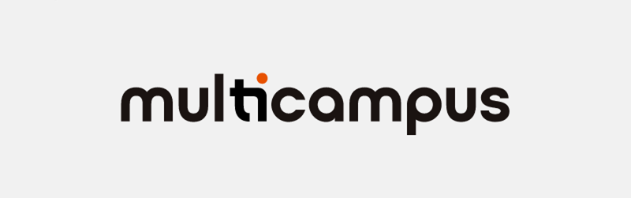

	

# :books:Curriculum

	

### 멀티캠퍼스 부트캠프(21.09~21.12)

#### :white_check_mark:학습 성과

- Java 기초부터 자료구조, 스프링과 같은 필수 기술능력 습득
-  Java 기반 웹 개발에서 중요한 객체지향 개념을 이해하고 활용할 수 있는 기술능력 습득 
- sql을 활용해 데이터베이스에서 crud 작업을 수행할 수 있는 기술능력 습득 
- React 기반의 웹 서비스 개발 경험 
- Restful API 사용 경험 
- Git 등 형상관리 프로세스에 익숙해짐 
- Notion, Slack 등 협업툴에 익숙해짐

# :scroll:Tech Stack

## Studying

## Use well

## Have used

## Tool

# :zap:Project

